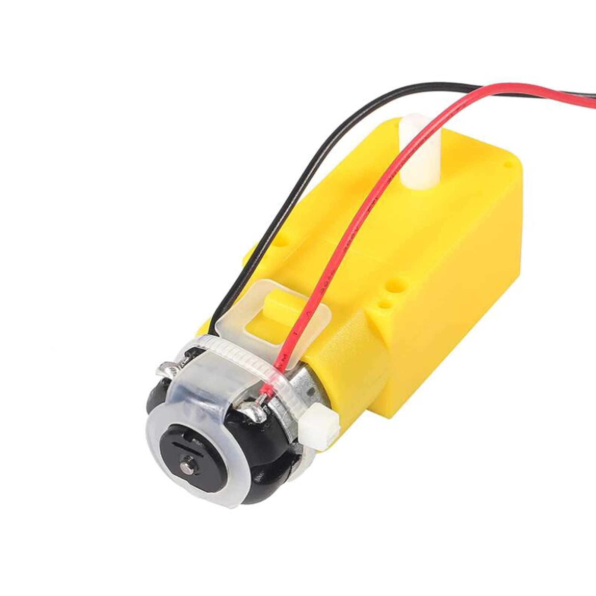
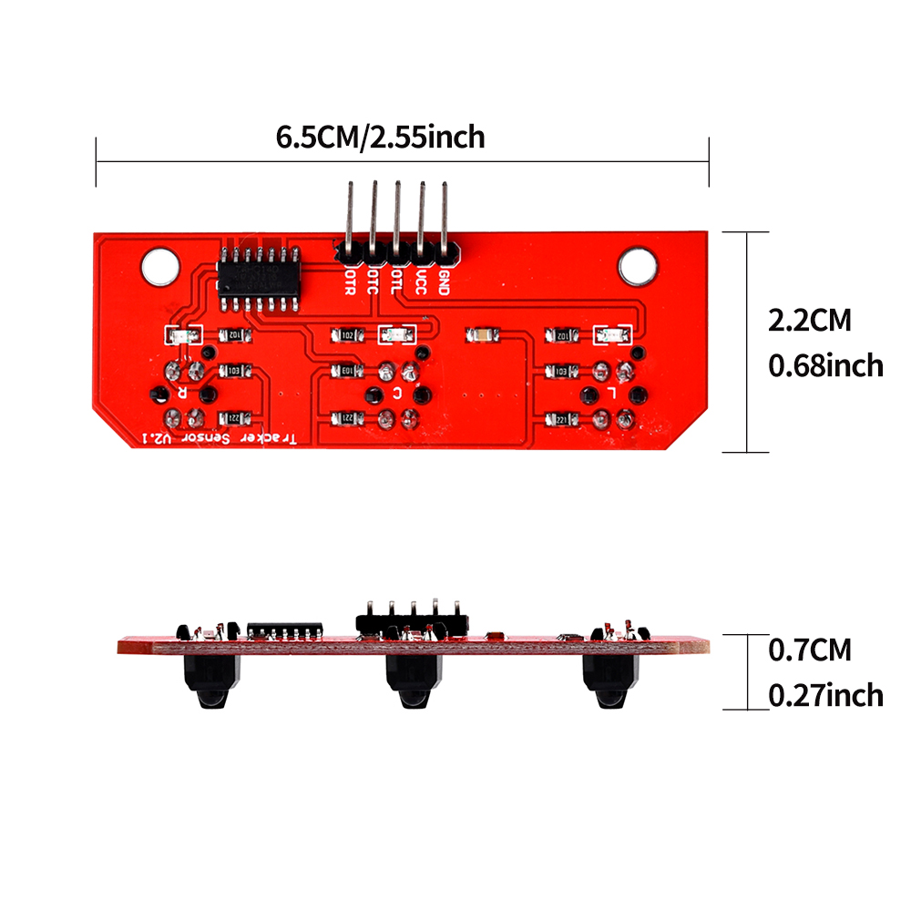
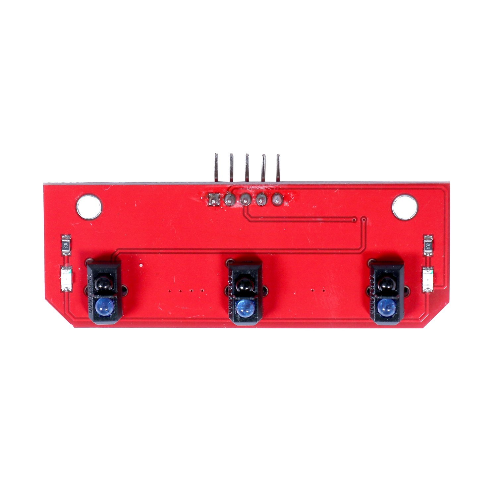
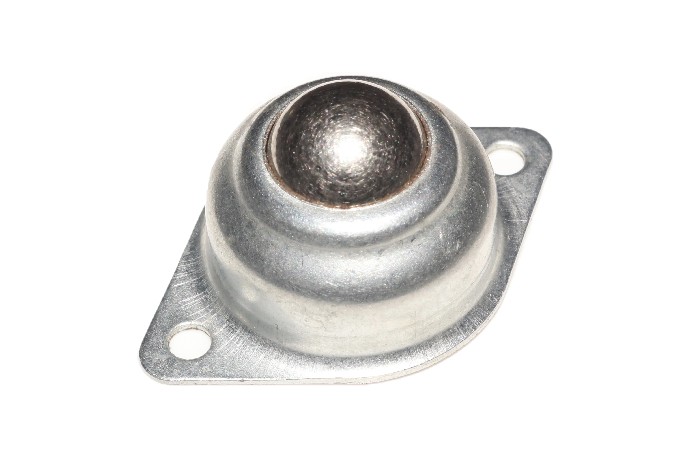
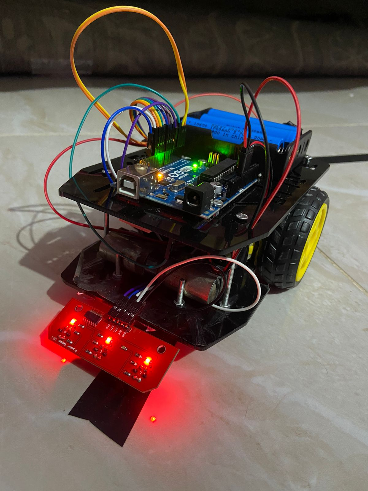
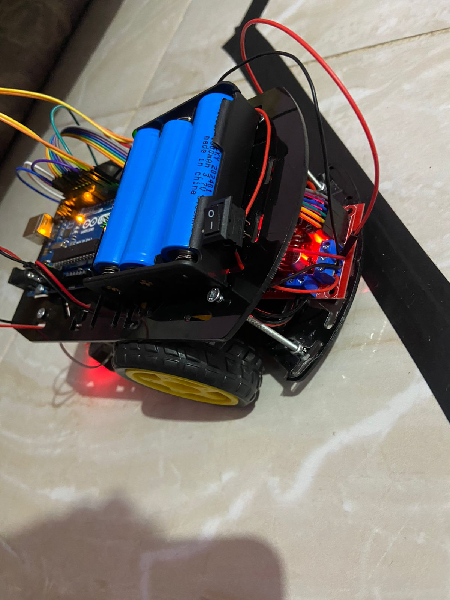
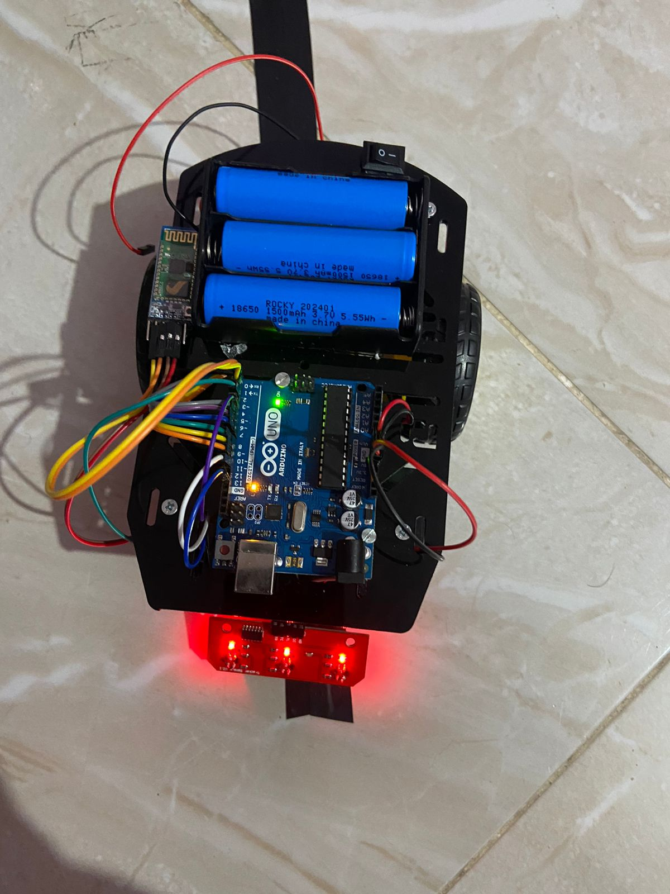

# Line Follower Robot with Arduino Uno


This is a **line-following robot** built using an **Arduino UNO** as a university project.  
The robot is capable of following **black tracks on white surfaces**, including **sharp turns**, **curved paths**, and even **interrupted lines**, with high reliability.

Although its speed is relatively slow, it prioritizes accuracy.  
> 🔁 The robot **does not support path decisions or junctions** (like T-shaped intersections). If it encounters one, it will likely treat it as the end of the line and begin turning in place to reacquire the path.

---

## 🚀 Features

- Follows curved, dashed, or sharply-angled black lines.
- Can handle interruptions in the track without getting lost.
- Bluetooth control available via HC-05 (optional).
- Based on simple `if`-logic (no PID).
- Expandable: add more sensors or motors as needed.

---

## 🔩 Components Used

> `(*)` = essential components

- `*` Arduino UNO (You can use another microcontroller)
- `*` L298N Motor Driver (Any compatible driver will work, but motor driver is essential)
- `*` Chassis (Custom or prebuilt – recommend designing your own)
- `*` 3×18650 Li-ion Batteries 3.7V each Total ~11.1V (Recommended to stay close to 12V for stable L298N performance.)
- Battery Holder (3×18650)
- Switch ON/OFF
- Small Breadboard
- Small Buzzer (5V)
- `*` 2× TT Geared Motors (Expandable up to 4 motors)
- HC-05 Bluetooth Module
- Metal Caster Wheel
- `*` 3-Channel IR Sensor (Number of sensors can vary depending on logic)

📷 **Geared Motor**  
<br>

📷 **3-Channel IR Sensor Photos**<br>

<br><br>
  
📷 **Metal Caster Wheel Photo**<br>
<br><br>


---

## 📸 Robot Photos  



<br><br>

---

<!-- ## 🎬 Demo Videos

- 📹 [`Demo Video 1`](Videos/demo1.mp4) – General line following and Bluetooth control  
- 📹 [`Demo Video 2`](Videos/demo2.mp4) – Handling curves and gaps

--- -->

## ⚙️ How It Works

- The IR sensor array detects black lines on a white surface.
- Based on sensor readings, the robot adjusts motor speeds using simple `if-else` logic.
- No PID controller used.
- Code written in Arduino IDE (`code/line_tracker_robot_src.ino`).

---

## 📁 Repository Structure
<pre>
Line-Follower-Robot/
├── code/
│   └── line_tracker_robot_src.ino
├── Images/
│   ├── Components/
|   |   ├── 3_Chanel_IR1.jpg
|   |   ├── 3_Chanel_IR2.jpg
|   |   ├── Metal_Caster_Wheel.jpg
|   |   └── TT_Motor.jpg
│   ├── RobotPhotos/
|   |   ├── photo1.jpg
|   |   ├── photo2.jpg
|   |   └── photo3.jpg
│   └── Schematic/
|       ├── Line Follower Robot Fritzing Schematic.png
|       └── Line Follower Robot Schematic Diagram.png
├── Schematic Diagram/
|   ├── Line Follower Robot Fritzing Schematic.pdf
|   └── Line Follower Robot Schematic Diagram.pdf
├── videos/
│   ├── demo1.mp4
│   └── demo2.mp4
├── LICENSE
└── README.md
</pre>

---

## 🧩 Challenges & Lessons Learned


### 1. Poor Chassis Design  
We used a low-quality ready-made chassis which limited stability and component placement.  
**Tip**: Design and build your own chassis to fit your specific layout.

### 2. Bad IR Sensor  
The IR sensor we initially used was very poor in accuracy and reliability.  
**Tip**: Choose high-quality IR sensors and avoid the one shown above.

### 3. Bluetooth Instability (No Voltage Divider)  
Not adding a voltage divider to the **RX pin** of the HC-05 module caused unstable behavior and potential damage over time.  
**Tip**: Use a voltage divider — e.g. `1.8kΩ` and `3.3kΩ` resistors — to safely step down Arduino TX (5V) to HC-05 RX (3.3V logic).<br>
Wiring Example:
```
Arduino TX → 1.8kΩ → HC-05 RX
               ↓
             3.3kΩ
               ↓
              GND
```

---

## 📱 Bluetooth Control

The Arduino sketch supports receiving basic commands via UART.  
You can use a mobile terminal app to control the robot (e.g. forward, stop, left, right).

---

## 🧠 Final Notes

- The project is part of a university coursework.
- The logic is simple but functional, suitable for beginners.
- Can be upgraded later with PID or additional sensors.

---

## 👥 Team Members

- **Ahmed Waheed**   
- **Eslam Dahy**

---

## 📜 License

This project is free to use for learning and educational purposes.  
Attribution is appreciated but not required.

---
